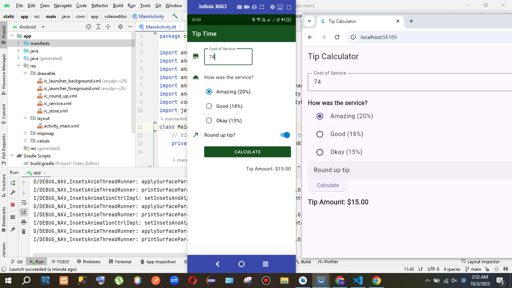

 

https://chatgpt.com/share/68defa08-3318-8010-bfee-ab057bfa0b39

 

Let’s build your Flutter APK step by step.

🟢 Step 1: Make sure everything is ready

In your Flutter project root, run:

flutter clean
flutter pub get
flutter doctor

👉 Fix any errors shown by flutter doctor (especially Android SDK / Java).

🟢 Step 2: Build a debug APK (quick test)
flutter build apk --debug

This will generate a debug APK (not optimized, but quick to install).

📂 Location:

build/app/outputs/flutter-apk/app-debug.apk

🟢 Step 3: Build a release APK (for publishing / sharing)
flutter build apk --release

📂 Location:

build/app/outputs/flutter-apk/app-release.apk

⚡ This APK is optimized, but you need signing if you want to upload it to Play Store.

🟢 Step 4: Optional – Split per architecture (smaller APKs)
flutter build apk --split-per-abi

📂 Output:

build/app/outputs/flutter-apk/app-arm64-v8a-release.apk
build/app/outputs/flutter-apk/app-armeabi-v7a-release.apk
build/app/outputs/flutter-apk/app-x86_64-release.apk

👉 These APKs are smaller and optimized for specific devices.

🟢 Step 5: Install APK on your device

Use adb (make sure your phone is connected and USB debugging enabled):

adb install build/app/outputs/flutter-apk/app-release.apk

✅ Done! Now you have your APK.
